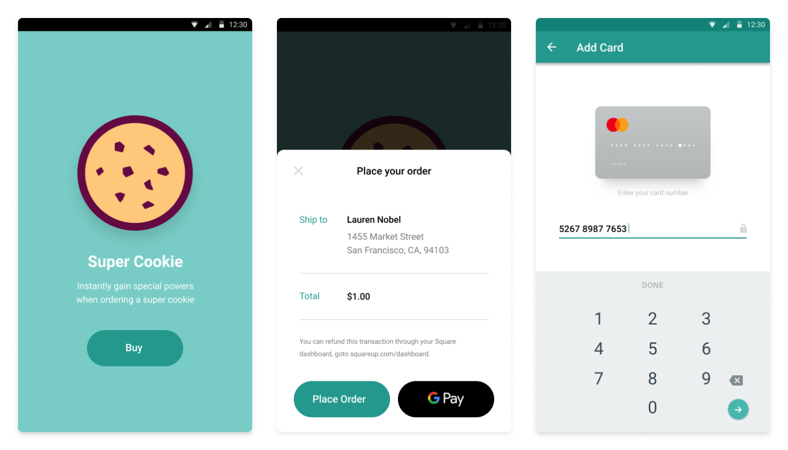

#  React Native Plugin for In-App Payments SDK Quick Start




## Assumptions and prerequisites

This quick start guide makes the following assumptions:

* You have read the [In-App Payments SDK Overview]. This quick start focuses on getting
  the sample app installed and running to demonstrate how the In-App Payments SDK works.
* You have a Square account enabled for payment processing. If you have not
  enabled payment processing on your account (or you are not sure), visit
  [squareup.com/activate].
* You are familiar with basic React Native development.

## Before you run the In-App Payments Quick Start

### Install the required tools

* Follow the **Building Projects with Native Code** instructions in the
[React Native Getting Started] guide to setup your React Native development
environment.
* Install `yarn` from [yarnpkg.com]
* Confirm your environment meets the In-App Payments SDK build requirements listed in the [root README] for this repo.
* Clone this repo (if you have not already):
  `git clone https://github.com/square/in-app-payments-react-native-plugin`

### Install dependencies for `react-native-in-app-payments-quickstart`

Change to the quick start sample folder and install the plugin using `yarn`:

  ```bash
  cd <YOUR_PROJECT_DIRECTORY>/react-native-in-app-payments-quickstart
  yarn
  ```

## Step 1: Get a Square Application ID and Location ID 

1. Sign in to your [Application Dashboard](https://connect.squareup.com/apps).
1. Click the **New Application** button on the **Applications** page
1. Give your application a name and then click the **Create Application** button.
1. On the **Credentials** page of the application control panel, copy the
   **Application ID**.
1. On the **Locations** page of the application control panel, copy the
   **Location ID** of one of your locations.


## Step 2: Configure the sample app
1. Open `<YOUR_PROJECT_DIRECTORY>/react-native-in-app-payments-quickstart/app/Constants.js`
1. On line 16, replace `REPLACE_ME` with the Application ID from **Step 1**
1. On line 20, replace `REPLACE_ME` with the Location ID from **Step 1**


## Step 3: Run the React Native sample app for iOS

Run the React Native project from the `react-native-in-app-payments-quickstart` project folder:

  ```bash
  cd /PATH/TO/LOCAL/react-native-in-app-payments-quickstart
  react-native run-ios
  ```

> **NOTE**: Make sure the folder `/PATH/TO/LOCAL/react-native-in-app-payments-quickstart/node_modules/react-native-square-in-app-payments/node_modules`
  is empty before you run `run-ios`.

## Step 4: Run the React Native sample app for Android

1. Open the Android project,
   `<YOUR_PROJECT_DIRECTORY>/react-native-in-app-payments-quickstart/android/` in Android Studio.
1. Confirm you have installed the required Android SDK. If you are
   unsure, the In-App Payments SDK build requirements are listed in the [root README] for this repo.
1. Configure and start an Android emulator that runs Android API 27 (Oreo, 8.0),
   or connect your dev machine to an Android device running Android API 27 with
   development mode enabled.
1. Run the React Native project from the `react-native-in-app-payments-quickstart`
   project folder:
    ```bash
    cd /PATH/TO/LOCAL/react-native-in-app-payments-quickstart
    react-native run-android
    ```

> **NOTE**: Make sure the folder `/PATH/TO/LOCAL/react-native-in-app-payments-quickstart/node_modules/react-native-square-in-app-payments/node_modules`
  is empty before you run `run-android`.

## Step 5: Use the nonce in a cURL payment command
Take a payment with the card nonce by executing the cURL command written into the debug output.
of your development environment. 

Update the cURL command by completing the following steps:

1. Replace the Location ID placeholder in the cURL query string with the 
location ID that you copied in **Step 1**.
1. Replace the access token placeholder with your access token. 
1. Run the cURL command to take a payment in your Square account.

>**Note:** We provide a cURL command in the debug output that you can use to easily test the payment with our [Transactions API](https://developer.squareup.com/docs/transactions-api/what-it-does). Your production app should use a secure backend service to make calls to the Transactions API and should never expose your access token in the client.

You can view the [transaction details in Square Dashboard].

## Step 6: Optional - Use the nonce with the backend server

In a real app, you'd have a backend service running to process the payment and not be using curl commands.

Square provides a sample backend service for this quickstart that can easily be deployed to Heroku. Follow the steps in the [backend service setup guide] and choose 'Option 2: Use the Square Mobile Backend Quickstart URL'.

[//]: # "Link anchor definitions"
[In-App Payments SDK Overview]: https://docs.connect.squareup.com/payments/in-app-payments-sdk/what-it-does
[squareup.com/activate]: https://squareup.com/activate
[React Native Getting Started]: https://facebook.github.io/react-native/docs/getting-started
[root README]: ../README.md
[transaction details in Square Dashboard]: https://squareup.com/dashboard/sales/transactions
[backend service setup guide]: take_a_payment.md
